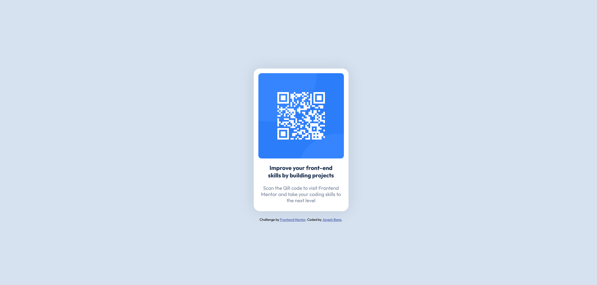

# Frontend Mentor - QR code component solution

This is a solution to the [QR code component challenge on Frontend Mentor](https://www.frontendmentor.io/challenges/qr-code-component-iux_sIO_H). Frontend Mentor challenges help you improve your coding skills by building realistic projects.

## Table of contents

-   [Overview](#overview)
    -   [Screenshot](#screenshot)
    -   [Links](#links)
-   [My process](#my-process)
    -   [Built with](#built-with)
    -   [What I learned](#what-i-learned)
-   [Author](#author)

**Note: Delete this note and update the table of contents based on what sections you keep.**

## Overview

### Screenshot



### Links

-   Solution URL: [Github Repo](https://github.com/Jolterix20/qr-code-component)
-   Live Site URL: [Live Site](https://jolterix20.github.io/qr-code-component/)

## My process

### Built with

-   HTML5
-   CSS
-   Flexbox

### What I learned

This project helped me practice my flexbox skills for arranging items in a layout. I used different flexbox properties to aligning the items according to the needs specified in the project.

Following are some snippets I used to create the design:

```css
.wrapper {
	display: flex;
	flex-direction: column;
	justify-content: center;
	align-items: center;
	width: 100%;
	height: 100vh;
}

.card {
	display: flex;
	flex-direction: column;
	align-items: center;

	width: 275px;
	height: 430px;
	padding: 15px;

	border-radius: 20px;
	background-color: hsl(0, 0%, 100%);

	box-shadow: 0 0 50px rgba(0, 0, 0, 0.1);
}
```

## Author

-   Website - Jayesh Bane
-   Frontend Mentor - [@Jolterix20](https://www.frontendmentor.io/profile/Jolterix20)
